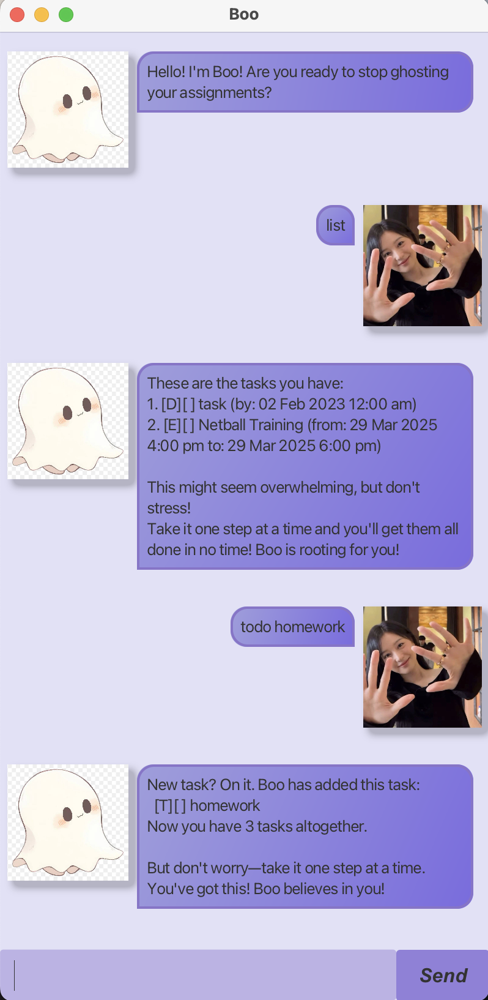

# Boo User Guide



## Product Introduction
Boo is your cheerful, friendly and encouraging chatbot designed to help you manage your tasks with ease and keep you on track! Whether you're juggling your todos, deadlines, events or more, Boo will help you keep track of tasks so that you will stop ghosting your responsibilities! 👻

## Adding Todos
**Action**: To add a todo task, use the following command:
```
todo <DESCRIPTION>
```

**Outcome**: Boo will add the task to the list.

<ins>**Examples**:</ins>
- `todo buy groceries`
- `todo read book`

<ins>**Expected Output**:</ins>
```
New task? On it. Boo has added this task: 
 [T][] buy groceries
Now you have 4 tasks altogether.

But don't worry-take it one step at a time. You've got this! Boo believes in you!
```

## Adding Deadlines
**Action**: To add a deadline task, use the following command:

```
deadline <DESCRIPTION> /by <dd/MM/yyyy or dd/MM/yyyy HHmm>
```

**Outcome**: Boo will add the task with your specified deadline.

<ins>**Examples**:</ins>
- `deadline coding assignment /by 10/02/2025`
- `deadline Homework /by 21/02/2025 1400`

<ins>**Expected Output**:</ins>
```
New task? On it. Boo has added this task: 
 [D][] coding assignment (by: 10 Feb 2025 12:00am)
Now you have 5 tasks altogether.

But don't worry-take it one step at a time. You've got this! Boo believes in you!
```

## Adding Events

**Action**: To add an event, use the following command:
```
event <DESCRIPTION> /from <dd/MM/yyyy or dd/MM/yyyy HHmm> /to <dd/MM/yyyy or dd/MM/yyyy HHmm>
```

**Outcome**: Boo will add the event to the list with your specified timeline.

<ins>**Examples**:</ins>
- `event Korea trip /from 05/03/2025 /to 29/03/2025 1200`
- `event Netball Training /from 29/03/2025 1600 /to 29/03/2025 1800`

<ins>**Expected Output**:</ins>
```
New task? On it. Boo has added this task: 
 [E][] Korea trip (from: 05 Mar 2025 12:00am to: 29 Mar 2025 12:00pm)
Now you have 6 tasks altogether.

But don't worry-take it one step at a time. You've got this! Boo believes in you!
```

## Marking tasks
**Action**: To mark a task, use the following command:
```
mark <taskID>
```
*_Note: taskID must be an integer._

**Outcome**: Boo will mark the task with that taskID as done.

<ins>**Examples**:</ins>
- `mark 4`

<ins>**Expected Output**:</ins>
```
YAY!!! Boo has marked this task as done:
 [T][X] buy groceries

Boo knew you could do it! Boo is so proud of you <3
```

## Unmarking tasks
**Action**: To unmark a task, use the following command:
```
unmark <taskID>
```
*_Note: taskID must be an integer._

**Outcome**: Boo will unmark the task with that taskID, i.e. task marked as undone.

<ins>**Examples**:</ins>
- `unmark 4`

<ins>**Expected Output**:</ins>
```
Noted! Boo has marked this task as not done yet:
 [T][] buy groceries

No worries-these things happen! You got this!
```

## Deleting tasks
**Action**: To delete a task, use the following command:
```
delete <taskID>
```
*_Note: taskID must be an integer._

**Outcome**: Boo will delete the task with that taskID from the list.

<ins>**Examples**:</ins>
- `delete 4`

<ins>**Expected Output**:</ins>
```
Got it! Boo has removed this task:
 [T][X] buy groceries

YAY!!! You are now only left with 3 tasks! 
Keep up the good work!
```

## Listing tasks
**Action**: To list all the tasks, use the following command:
```
list
```

**Outcome**: Boo will list out all the tasks, in chronological order.

<ins>**Examples**:</ins>
- `list`

<ins>**Expected Output**:</ins>
```
These are the tasks you have: 
1. [T][] buy groceries
2. [T][X] read book
3. [D][X] coding assignment (by: 10 Feb 2025 12:00am)
4. [D][] Homework (by: 21 Feb 2025 2:00pm)
5. [E][] Korea trip (from: 05 Mar 2025 12:00am to: 29 Mar 2025 12:00pm)
6. [E][] Netball training (from: 29 Mar 2025 4:00pm to: 29 Mar 2025 6:00pm)

This might seem overwhelming, but don't stress!
Take it one step at a time and you'll get them all done in no time! Boo is rooting for you!
```

## Exit
**Action**: To exit the chabot, use the following command:
```
bye
```

**Outcome**: Boo will exit.

<ins>**Examples**:</ins>
- `bye`

<ins>**Expected Output**:</ins>
```
NOOO please don't go!! Boo will miss you :( Come back soon!!
```

